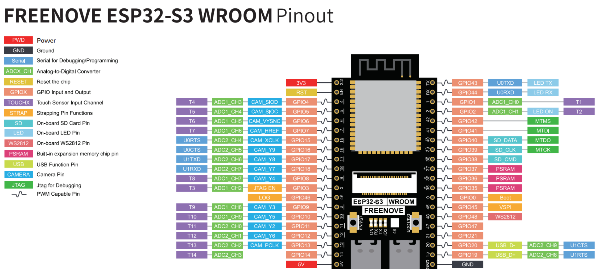
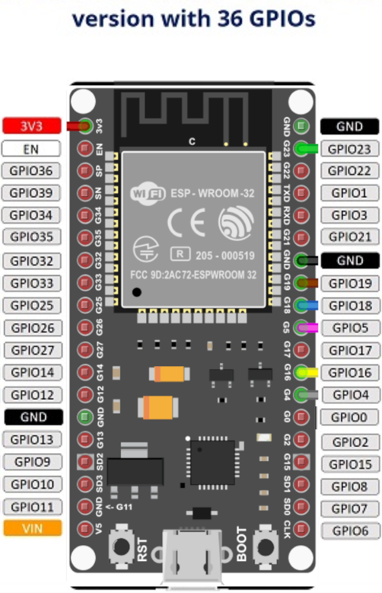
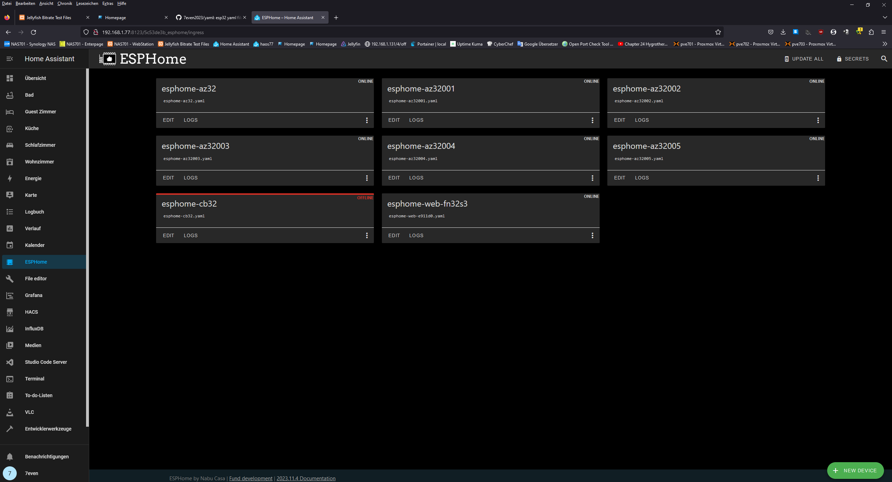
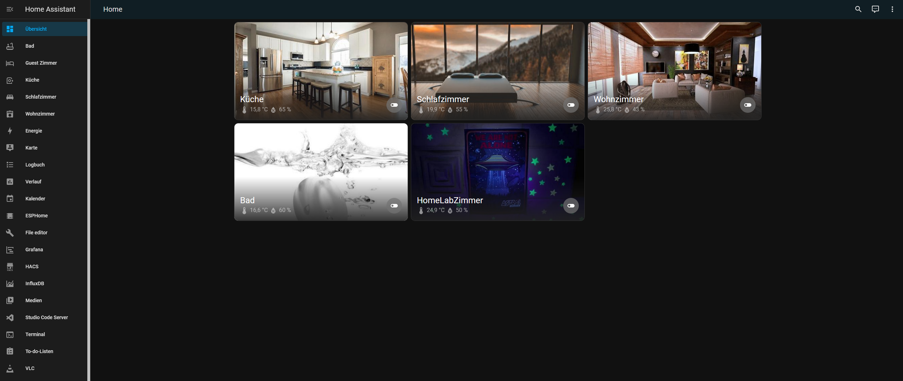
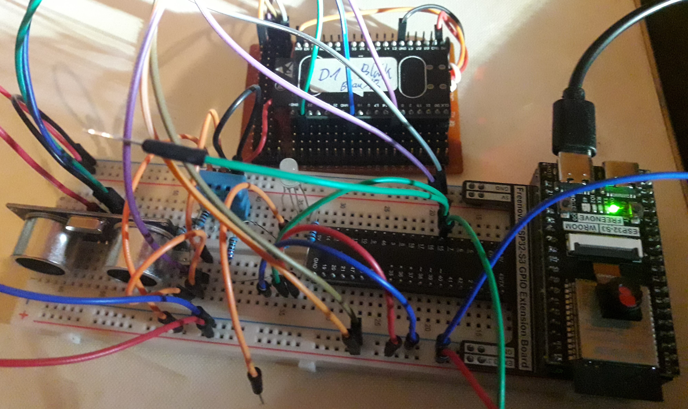

# 32wroom tutorials - yaml test files 
## fn-esp32s3 & az-esp32v3 
### Freenove_Ultimate_Starter_Kit_for_ESP32-S3 FNK0082 A1B0 

### note: source Freenove tutorial chapters playlist
https://www.youtube.com/playlist?list=PLlCFIOdyWXfXNI98tTjUfWsx7-i59nKBr

# AZ esp32 v4
## note: source GIMP handdraw reajust real pin out chip

# haos v11.1 esphome
## note: day1 unboxed test 

# test aufbau v0.1 
## note: day1 unboxed test 

# test aufbau v1.0 az32001 küche 
## button + relais(incl led) + dht11 + lcd
## note: value id temp + humi
