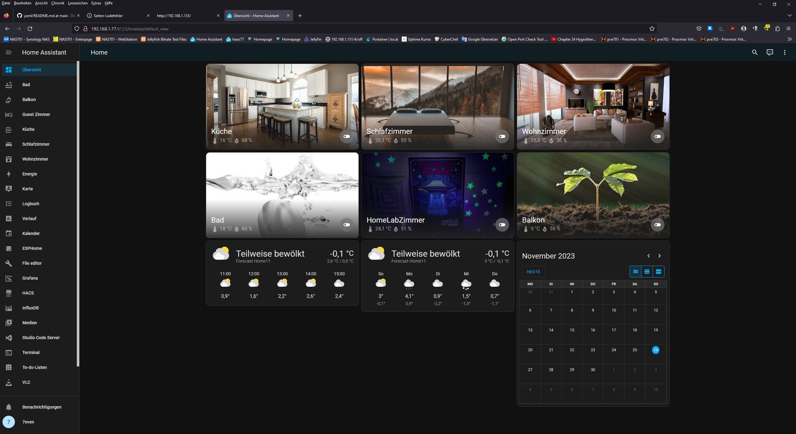

# 32wroom tutorials - yaml test files 
## fn-esp32s3 (breadboard cam)

### Freenove_Ultimate_Starter_Kit_for_ESP32-S3 FNK0082 A1B0 

### note2: fnk0082 ult. part list

### note3: board + 10x led-bar + 10x 220ohm resistors 
### use GPIO5 taster2 running lights 
### <a href="https://github.com/7even2023/yaml/blob/76fa6ba39aad9fe83afc449854af3aca2f6d9836/ch0-001_esphome-web-e911d0.yaml">ch0-001_esphome-web-e911d0.yaml</a>

### note4: source Freenove tutorial chapters playlist

https://www.youtube.com/playlist?list=PLlCFIOdyWXfXNI98tTjUfWsx7-i59nKBr

# az-esp32v4 (solded testboard dotted pcb)  
### note: source GIMP handdraw reajust real pin out chip 

# haos v11.1 dashboard home panel overview 

## note: haos esphome devices panel overview

# env.0 az32 = home lab (guest_room)

### button + 4xrelais(incl led) + dht11 + ultrasonic
### note: value id temp + humi + ultraschall
### <a href="https://github.com/7even2023/yaml/blob/76fa6ba39aad9fe83afc449854af3aca2f6d9836/ch0-001_esphome-web-e911d0.yaml">ch0-000_esphome-az32.yaml</a>

# env.1 az32001 = küche (kitchen)

### button + relais(incl led) + dht11 + lcd
### note: value id temp + humi 
### <a href="https://github.com/7even2023/yaml/blob/76fa6ba39aad9fe83afc449854af3aca2f6d9836/ch0-001_esphome-web-e911d0.yaml">ch1-001_esphome-az32001.yaml</a>

# env.2 az32002 = bad (bath)

### button + relais(incl led) + dht11 
### <a href="https://github.com/7even2023/yaml/blob/76fa6ba39aad9fe83afc449854af3aca2f6d9836/ch0-001_esphome-web-e911d0.yaml">ch1-002_esphome-az32002.yaml</a>

# env.3 az32003 = schlafzimmer (sleeping_room)

### button + relais(incl led) + dht11 
### <a href="https://github.com/7even2023/yaml/blob/76fa6ba39aad9fe83afc449854af3aca2f6d9836/ch0-001_esphome-web-e911d0.yaml">ch1-003_esphome-az32003.yaml</a>

# env.4 az32004 = wohnzimmer (living_room)

### relais(incl led) + dht11 
### <a href="https://github.com/7even2023/yaml/blob/76fa6ba39aad9fe83afc449854af3aca2f6d9836/ch0-001_esphome-web-e911d0.yaml">ch1-004_esphome-az32004.yaml</a>

# env.5 az32005 = flur !(todo splitt env4+5+7) wip no pics 

### motion(ir) + neopixel rgb light (n.a. relais(incl led) + dht11) 
### <a href="https://github.com/7even2023/yaml/blob/76fa6ba39aad9fe83afc449854af3aca2f6d9836/ch0-001_esphome-web-e911d0.yaml">ch1-005_esphome-az32005.yaml</a>

# env.6 cb32 = balkon (outside/aussen)

### relais(incl led) + dht11 
### <a href="https://github.com/7even2023/yaml/blob/76fa6ba39aad9fe83afc449854af3aca2f6d9836/ch0-001_esphome-web-e911d0.yaml">chx-00x_esphome-cb32.yaml</a>

wip-changelog261123-1234: 
todo fix hyperlinks in readme to yaml perma file links 
todo add v1.1 code balkon=outside/aussen flur wohnzimmer

